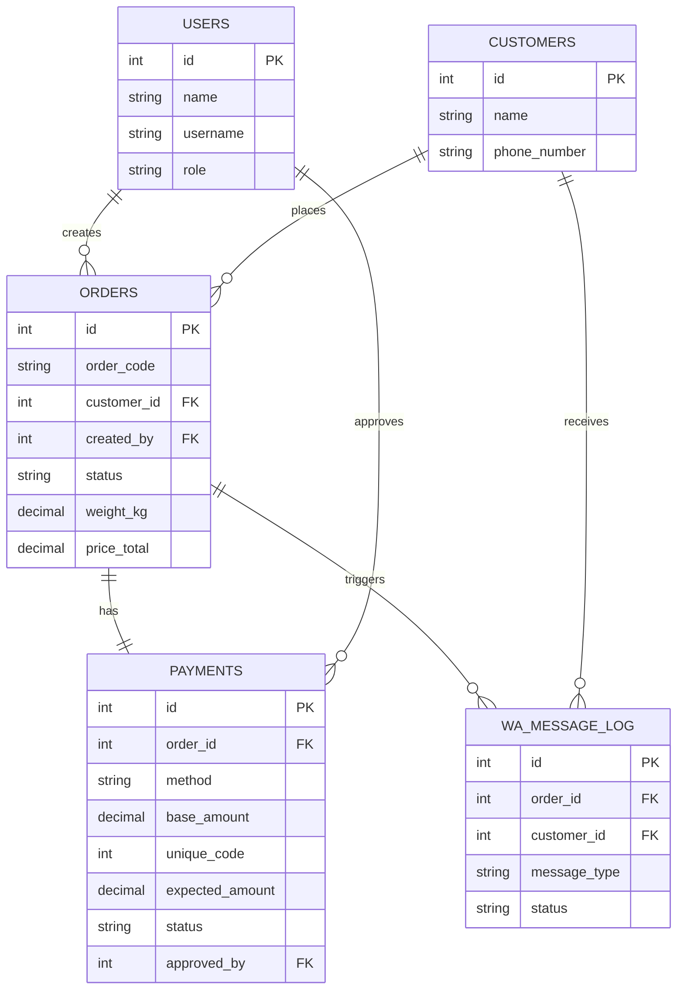

# ERD — Sistem Manajemen Laundry dengan Notifikasi WhatsApp

## Daftar Tabel

### 1. users
Staf/owner yang login ke sistem.

| Field | Tipe | Keterangan |
|---|---|---|
| id | INT PK | |
| name | VARCHAR | |
| username | VARCHAR UNIQUE | |
| password_hash | VARCHAR | |
| role | ENUM(owner, staff) | |
| created_at | TIMESTAMP | |

### 2. customers

| Field | Tipe | Keterangan |
|---|---|---|
| id | INT PK | |
| name | VARCHAR | |
| phone_number | VARCHAR | Nomor WA aktif, wajib |
| address | VARCHAR | Opsional |
| created_at | TIMESTAMP | |

### 3. laundry_settings
Konfigurasi tunggal (singleton) untuk tarif dan info pembayaran.

| Field | Tipe | Keterangan |
|---|---|---|
| id | INT PK | |
| business_name | VARCHAR | |
| price_per_kg | DECIMAL | Tarif reguler |
| express_price_per_kg | DECIMAL | Tarif express, opsional |
| bank_name | VARCHAR | |
| bank_account_number | VARCHAR | |
| bank_account_name | VARCHAR | |
| qris_image_url | VARCHAR | |

### 4. orders

| Field | Tipe | Keterangan |
|---|---|---|
| id | INT PK | |
| order_code | VARCHAR UNIQUE | Kode pesanan |
| customer_id | INT FK → customers.id | |
| created_by | INT FK → users.id | |
| service_type | ENUM(reguler, express) | |
| status | ENUM(menunggu, diproses, selesai, diambil) | |
| weight_kg | DECIMAL NULLABLE | Diisi saat status selesai |
| price_total | DECIMAL NULLABLE | Dihitung saat status selesai |
| notes | VARCHAR | |
| created_at | TIMESTAMP | |
| updated_at | TIMESTAMP | |

### 5. payments

| Field | Tipe | Keterangan |
|---|---|---|
| id | INT PK | |
| order_id | INT FK → orders.id | |
| method | ENUM(cash, transfer, qris) | |
| base_amount | DECIMAL | Total harga sebelum kode unik |
| unique_code | INT | 3 digit, ditambahkan ke base_amount untuk transfer, memudahkan owner mencocokkan mutasi manual |
| expected_amount | DECIMAL | base_amount + unique_code |
| status | ENUM(pending, paid) | |
| approved_by | INT FK NULLABLE → users.id | Owner/staf yang menekan tombol approve |
| paid_at | TIMESTAMP NULLABLE | |
| proof_image_url | VARCHAR NULLABLE | Bukti transfer dari customer, referensi saja — bukan trigger otomatis |

### 6. wa_message_log

| Field | Tipe | Keterangan |
|---|---|---|
| id | INT PK | |
| order_id | INT FK → orders.id | |
| customer_id | INT FK → customers.id | |
| message_type | ENUM(processing, invoice, reminder) | |
| message_content | TEXT | |
| status | ENUM(sent, failed) | |
| sent_at | TIMESTAMP | |

## Relasi
- customers 1—N orders
- users 1—N orders (created_by)
- orders 1—1 payments
- orders 1—N wa_message_log
- customers 1—N wa_message_log
- users 1—N payments (approved_by, opsional — terisi setelah owner klik approve)
- laundry_settings: tabel konfigurasi tunggal, tidak berelasi langsung ke tabel lain (dipakai secara aplikatif untuk kalkulasi harga & isi invoice)

## Catatan Desain
- ERD ini didesain single-tenant (1 laundry). Jika akan dijual sebagai produk ke banyak laundry sekaligus (SaaS), tambahkan tabel `businesses` dan kolom `business_id` di `users`, `customers`, `orders`, dan `laundry_settings` pada Fase 2.
- `payments` dipisah dari `orders` agar riwayat pembayaran lebih terlacak (misal ada perubahan metode bayar) dan mempermudah audit finansial ke depannya.
- `unique_code`/`expected_amount` di Fase 1 hanya membantu pencocokan manual oleh owner — status `paid` diubah lewat aksi approve eksplisit, bukan otomatis. Jika di Fase 2 mau upgrade ke verifikasi otomatis (API mutasi bank/payment gateway), tabel `bank_mutation_log` bisa ditambahkan kembali tanpa mengubah struktur `payments` yang sudah ada.

